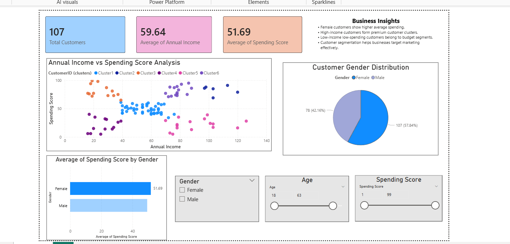

# Customer-Segmentation-Dashboard-PowerBI

## Overview
This project focuses on Customer Segmentation using Power BI. The dashboard analyzes customer behavior based on Annual Income, Spending Score, Gender, and Age to identify different customer groups and business insights.

---

## Tools Used
- Power BI
- Data Visualization
- Clustering & Segmentation
- Business Analytics

---

## Features
- KPI Cards
- Scatter Plot for Customer Clustering
- Bar Chart Analysis
- Pie Chart Distribution
- Interactive Slicers/Filters
- Customer Behavior Insights

---

## Dataset Fields
- Customer ID
- Gender
- Age
- Annual Income
- Spending Score

---

## Key Insights
- High-income customers form premium customer segments.
- Female customers show higher average spending scores.
- Customer segmentation helps improve targeted marketing strategies.

---

## Dashboard Visuals
- Customer Segmentation Scatter Plot
- Gender Distribution Pie Chart
- Average Spending Score by Gender
- KPI Overview Cards
- Interactive Filters

---

## Outcome
This project helped in understanding:
- Customer Analytics
- Data Visualization
- Dashboard Design
- Business Intelligence Concepts

---

## Dashboard Preview

## Author
Bhavana
